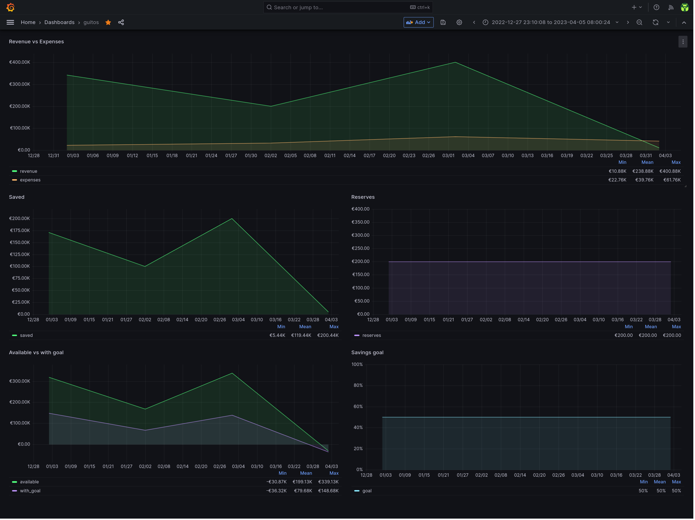

# guitos-exporter

Bash script that uploads the data from guitos JSON backups to influxdb

## Dependencies

- [bash](https://www.gnu.org/software/bash/)
- [coreutils (date)](https://www.gnu.org/software/coreutils/)
- [curl](https://curl.se/)
- [gzip](https://www.gnu.org/software/gzip/)
- [influxdb v2+](https://docs.influxdata.com/influxdb/v2.6/)
- [jq](https://stedolan.github.io/jq/)

## Relevant documentation

- [guitos](https://github.com/rare-magma/guitos)
- [InfluxDB API](https://docs.influxdata.com/influxdb/v2.6/write-data/developer-tools/api/)

## Instructions

1. Export [guitos.app](https://guitos.app) data as JSON.

   - See instructions here: [guitos](https://github.com/rare-magma/guitos)

   - Note that each budget name should follow this format: `YYYY-MM` `(2023-12)` otherwise it won't be possible to parse correctly the period that it corresponds to.

2. Copy `guitos_exporter_default.conf` to a new file named as `guitos_exporter.conf` and configure it (see the section below).

3. Execute `guitos_exporter.sh` with the path to the guitos json export file as the first argument.

Example:

```
./guitos_exporter.sh ~/downloads/guitos-2023-05-23T19_40_19.json
```

### Configuration file

The configuration file has a few options:

```
INFLUXDB_HOST='influxdb.example.com'
INFLUXDB_API_TOKEN='ZXhhbXBsZXRva2VuZXhhcXdzZGFzZGptcW9kcXdvZGptcXdvZHF3b2RqbXF3ZHFhc2RhCg=='
ORG='home'
BUCKET='guitos'
```

- `INFLUXDB_HOST` should be the FQDN of the influxdb server.
- `ORG` should be the name of the influxdb organization that contains the guitos price data bucket defined below.
- `BUCKET` should be the name of the influxdb bucket that will hold the guitos data.
- `INFLUXDB_API_TOKEN` should be the influxdb API token value.
  - This token should have write access to the `BUCKET` defined above.

## Troubleshooting

Run the script manually with bash set to trace:

```
bash -x ./guitos_exporter.sh
```

## Exported metrics information

- period: The name of the budget
- expenses: The total amount of expenses
- revenue: The total amount of revenue
- available: = revenue - expenses
- goal: % of revenue that should go into savings
- saved: = goal \* available / 100
- with_goal: = available - saved
- reserves: emergency fund/cash

## Exported metrics example

```
guitos,period=2023-05 expenses=600.10 revenue=1000 available=200.10 with_goal=120.20 saved=100 goal=10 reserves=1000 1612134000
```

## Example grafana dashboard

In `grafana-dashboard.json` there is an example of the kind of dashboard that can be built with `guitos-exporter` data:



Import it by doing the following:

1. Create a dashboard
2. Click the dashboard's settings button on the top right.
3. Go to JSON Model and then paste there the content of the `grafana-dashboard.json` file.
